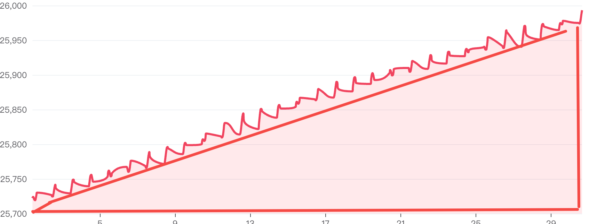
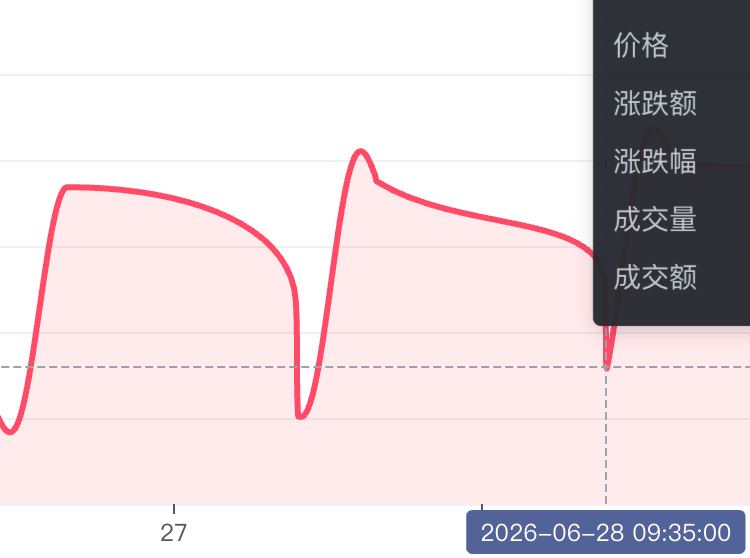
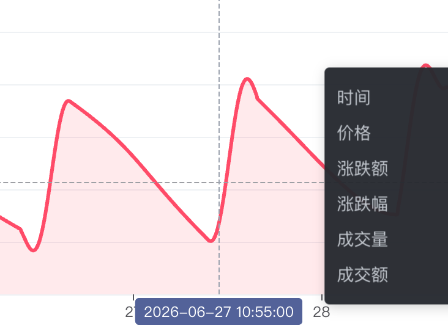

# ECharts 行情图 Demo 复现指引

本文记录从需求讨论到最终落地 ECharts 行情图 Demo 的制作过程。它不是完整对话转录，而是一份可复现的实现指引：读者可以按这里的阶段、判断节点和验证清单，在 React + Vite 项目中复刻这个 demo。

最终页面路径：

```text
/topics/echarts
```

核心文件：

```text
src/features/market-chart/EchartsMarketDemo.tsx
src/features/market-chart/EchartsMarketDemo.css
src/features/market-chart/marketModel.ts
src/features/market-chart/EchartsMarketDemo.test.tsx
src/features/market-chart/marketModel.test.ts
```

## 目标效果

这个 topic 的目标不是做完整交易软件，而是验证 vibe-coding 在复杂图表交互上的能力，重点包括：

- 使用 ECharts 绘制富途风格行情图。
- x 轴表示时间，y 轴表示价格。
- hover 展示交易信息：时间、价格、涨跌额、涨跌幅、成交量、成交额。
- 上方按钮切换范围：分时、5日、日K、周K、月K、季K、年K。
- 折线颜色跟随窗口趋势：上涨红色，下跌绿色。
- 主图和成交量图上下联动，保留同一组 x 轴数据。
- 支持在图形区域拖拽扩展和收缩当前 x 轴窗口。
- 支持边界回弹、reback 恢复、拖拽中无明显曲线抖动。

## 初始参考

需求开始时，参考的是富途风格指数详情页：上方是范围切换按钮，中间是红色走势折线和渐变填充，下方是成交量柱图，hover 时出现十字线和 tooltip。



这里有一个关键点：用户口中的“K线图”在本 demo 中落地为“行情折线/分时走势能力验证”，而不是传统 OHLC 蜡烛图。后续所有交互都围绕折线、面积填充、x 轴时间窗口展开。

## 第一步：项目接入 ECharts

依赖选择：

```bash
npm install echarts
```

ECharts 采用按需注册：

```ts
echartsUse([
  LineChart,
  BarChart,
  GridComponent,
  TooltipComponent,
  TitleComponent,
  MarkLineComponent,
  CanvasRenderer,
])
```

选择按需注册的原因是：

- 本 demo 只需要折线、柱状图、网格、标题、tooltip。
- 不需要引入完整 ECharts bundle 的所有图表类型。
- 方便后续用测试 mock `echarts/core`。

## 第二步：建立数据模型

数据模型放在 `marketModel.ts`，职责包括：

- 生成确定性模拟行情数据。
- 定义范围按钮配置。
- 生成当前可见窗口。
- 扩展和收缩窗口。
- 判断鼠标是否命中填充区或白色区。
- 格式化 tooltip 和窗口时间。

核心数据结构：

```ts
export type MarketPoint = {
  timestamp: number
  price: number
  volume: number
  turnover: number
  change?: number
  changePercent?: number
}

export type VisibleSeries = {
  range: MarketRange
  rawPoints: MarketPoint[]
  visiblePoints: MarketPoint[]
  windowStart: number
  windowEnd: number
}
```

### 为什么先用模拟数据

最初讨论过“联网爬虫或公开接口数据”。最终首版用本地确定性模拟数据，原因是：

- 离线也能打开 demo。
- 避免金融接口限流、停盘、跨域和 token 问题。
- 测试可以稳定复现。
- 字段结构仍然保留真实行情需要的信息，后续可替换数据源。

## 第三步：基础图表结构

ECharts option 里使用两个 grid：

- grid 0：价格折线和面积图。
- grid 1：成交量柱图。

后续视觉调整后，grid 留白统一为：

```ts
const priceGrid = { left: 64, right: 56, top: 46, height: 252 }
const volumeGrid = { left: 64, right: 56, top: 346, height: 68 }
```

同时加上两个图内标题：

- 价格
- 成交量

这样读者可以明确 y 轴对应的是哪块图，而不是只看到两个纵轴区域。

## 第四步：tooltip 和趋势色

tooltip 使用 `trigger: 'axis'`，并从 ECharts 回调参数里组装交易字段：

```ts
return formatTooltipRows(point)
  .map((row) => `<div class="tooltip-row"><span>${row.label}</span><b>${row.value}</b></div>`)
  .join('')
```

趋势色由当前窗口第一点和最后一点决定：

- 上涨：`#f0445f`
- 下跌：`#16a779`

面积填充最终改成“趋势色到白色透明”的纵向渐变，而不是单一淡红色：

```ts
areaStyle: { color: buildAreaGradient(trendColor, trendSoftColor) }
```

## 第五步：范围切换

范围按钮按固定顺序展示：

```ts
export const rangeKeys: RangeKey[] = [
  'intraday',
  'fiveDay',
  'day',
  'week',
  'month',
  'quarter',
  'year',
]
```

点击按钮时直接丢弃拖拽影响，回到该按钮对应的标准窗口：

```ts
function selectRange(nextRange: RangeKey) {
  setRangeKey(nextRange)
  setView(buildVisibleSeries(data, nextRange))
  setRebackView(null)
  setEdgeRebound(null)
  setIsAreaDragging(false)
  dragBaseViewRef.current = null
}
```

这个规则来自早期需求：active 状态不用随着拖拽改变；点击按钮要恢复固定范围。

## 第六步：拖拽交互的关键迭代

这部分是整个 demo 最容易做错的地方。

### 错误尝试 1：固定窗口平移

最开始实现成了“固定长度窗口左右平移”：

```text
05/31 - 06/30  向右拖  =>  05/30 - 06/29
```

这不符合需求。用户真正要的是扩展 x 轴覆盖范围：

```text
05/31 - 06/30  向右拖  =>  05/30 - 06/30
```

也就是右端保持不动，左端加入更早数据。因为图表宽度不变，所以 x 轴被压缩。

### 正确规则 1：填充区负责扩展

用户明确指出可拖区域是“曲线下方到 x 轴之间的填充面积”，不是价格图和成交量图之间的空白条。


最终规则：

- 在曲线下方填充区按下：进入 `expand` 模式。
- 向右拖：左开始时间变小，加入更早数据。
- 向左拖：右结束时间变大，加入更新数据。
- 如果右边已经是最新数据，显示右侧边缘回弹。

命中检测用几何判断，不依赖额外 DOM 覆盖层：

```ts
isPointInPriceArea(point, view.visiblePoints, geometry)
```

### 正确规则 2：白色区负责收缩

后续为了“把拖出来的区域拖回去”，增加了曲线上方白色区域拖拽：

- 在曲线上方白色区按下：进入 `shrink` 模式。
- 向右拖：左开始时间右移，收回左侧。
- 向左拖：右结束时间左移，收回右侧。
- 收到底时显示对应边缘回弹。

命中检测：

```ts
isPointInPriceWhitespace(point, view.visiblePoints, geometry)
```

### 正确规则 3：按像素映射原始采样点

早期步长按“天”跳，5日视图下会出现“不跟手”：小拖动没有效果，跨过阈值又跳很大一格。

最终改成：

```ts
const pointsPerPixel = baseView.rawPoints.length / plotWidth
return Math.max(1, Math.round(Math.abs(delta) * pointsPerPixel))
```

也就是拖动多少像素，就按当前 raw 数据密度换算要追加或收回多少原始采样点。

### 正确规则 4：拖拽中就更新

早期实现是在 `mouseup` 后一次性换数据，视觉上像“重新加载日期窗口”。最终改成：

- `mousedown`：判断命中区域和拖拽模式。
- `mousemove`：持续预览扩展/收缩后的窗口。
- `mouseup`：只结束拖拽状态。

拖拽期间关闭 ECharts 更新动画：

```ts
animation: !isDragging,
animationDurationUpdate: isDragging ? 0 : 260,
```

## 第七步：边界回弹

早期回弹是整张图表 `translateX`，效果不自然。

最终改成边缘灰色弹性区域：

- 不移动整张图表。
- 到左边界时左侧出现灰色区域。
- 到右边界时右侧出现灰色区域。
- 动画类似 iOS 的边缘阻尼反馈。

CSS 核心：

```css
.edge-rebound-left {
  left: 0;
  border-radius: 0 100% 100% 0 / 0 50% 50% 0;
  background: radial-gradient(ellipse at left, rgba(113, 122, 134, 0.24), rgba(113, 122, 134, 0));
}

.edge-rebound-right {
  right: 0;
  border-radius: 100% 0 0 100% / 50% 0 0 50%;
  background: radial-gradient(ellipse at right, rgba(113, 122, 134, 0.24), rgba(113, 122, 134, 0));
}
```

## 第八步：曲线抖动问题

拖拽过程中曾出现曲线尖峰和断崖，截图如下：





关键判断：

> x 轴范围连续变化时，如果每次都对当前 raw 数据重新分桶抽样，同一个视觉位置可能连接到不同的抽样点。ECharts 再用 smooth 曲线连接，就会出现尖峰和抖动。

修复策略：

- 图表渲染使用当前窗口内的 raw samples。
- 不在拖拽中对折线点重新分桶。
- 关闭 `smooth`，避免贝塞尔曲线拉出异常弧线。
- 成交量图使用同一组 raw samples，确保上下图 x 点一致。

实现：

```ts
const linePoints = getChartPoints(view)
const lineData = linePoints.map((point) => [
  point.timestamp,
  point.price,
  point.volume,
  point.turnover,
  point.change ?? 0,
  point.changePercent ?? 0,
])
```

同时保留 `downsampleAveragePoints`，因为它仍然可用于模型测试和未来大数据量场景，但当前 ECharts 绘制路径不再依赖它。

## 第九步：视觉整理

最后一次视觉整理做了三件事：

1. 给两个 y 轴区域加说明：
   - 价格
   - 成交量
2. 统一调整 grid padding，让左、右、上、下都有呼吸感。
3. 面积填充改为趋势色到白色透明的渐变。

渐变函数：

```ts
function buildAreaGradient(trendColor: string, trendSoftColor: string) {
  return {
    type: 'linear',
    x: 0,
    y: 0,
    x2: 0,
    y2: 1,
    colorStops: [
      { offset: 0, color: withAlpha(trendColor, 0.28) },
      { offset: 0.52, color: trendSoftColor },
      { offset: 1, color: 'rgba(255, 255, 255, 0)' },
    ],
  }
}
```

## 测试策略

测试分两层。

### 模型测试

`marketModel.test.ts` 覆盖：

- 范围顺序。
- 模拟数据稳定性。
- 平均抽样逻辑。
- 窗口扩展和边界回弹。
- 窗口收缩。
- 填充区和白色区命中检测。
- tooltip 字段格式化。
- raw samples 过滤。

### 组件测试

`EchartsMarketDemo.test.tsx` 通过 mock ECharts 验证：

- 路由渲染。
- 范围切换。
- 填充区拖拽扩展。
- 白色区拖拽收缩。
- 短距离拖拽也能响应。
- 边缘回弹不移动整张图。
- 图表使用 raw samples，避免 rebucket 抖动。
- 标注、grid padding、渐变配置存在。

测试里会 mock `echarts/core`：

```ts
vi.mock('echarts/core', () => ({
  init: vi.fn(() => echartsMock.chart),
  use: vi.fn(),
}))
```

这样不用真实 canvas，也能验证传入 ECharts 的 option 和事件处理。

## 验证命令

每次提交前运行：

```bash
npm test -- --run
npm run lint
npm run build
```

当前已知构建提示：

```text
Some chunks are larger than 500 kB after minification.
```

这是 ECharts 进入 bundle 后的体积提示，不影响 demo 运行。后续如果要优化，可以把 ECharts topic 做动态 import 或路由级拆包。

## 关键提交索引

这些提交对应从基础 demo 到交互修正的关键节点：

```text
f7c123e 实现ECharts行情折线图Demo
1779ef4 修正行情图填充区拖拽扩展逻辑
23a9827 优化行情图拖拽追加体验
9d166bd 优化行情图拖拽跟手和边缘回弹
85355db 支持行情图白色区域拖拽收缩
09d5412 修复行情图拖拽曲线抖动
46f6954 优化行情图视觉标注和渐变
```

## 复现顺序建议

如果从零复现，建议按这个顺序写：

1. 初始化 React + Vite 项目，配置路由和 topic 页面。
2. 安装并按需注册 ECharts。
3. 写 `marketModel.ts`，先生成稳定模拟数据。
4. 实现基础双 grid：价格折线 + 成交量柱图。
5. 实现 tooltip 和范围切换。
6. 实现趋势色和面积渐变。
7. 实现填充区命中检测和扩展窗口。
8. 实现白色区命中检测和收缩窗口。
9. 加入边缘回弹和 reback。
10. 修复拖拽中 rebucket 抖动，改用 raw samples 渲染。
11. 补齐测试，再做视觉 padding 和标注。

这个顺序比一次性写完更稳，因为每一步都可以单独验证，也更接近本 demo 的真实迭代过程。
