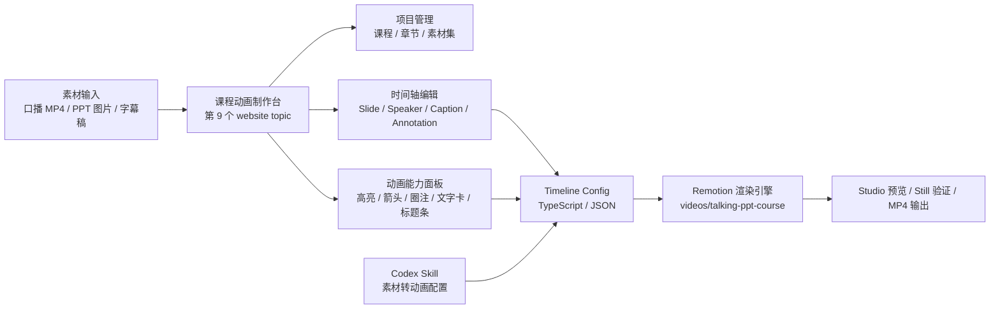
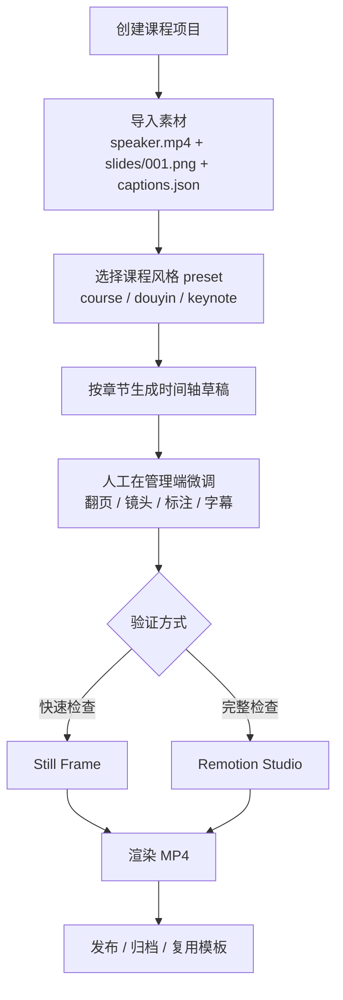

## 结论

**这个 topic 不应该只是一个 Remotion demo，也不应该只在 `videos` 目录里放一个可渲染模板。** 它应该成为 `ai-website` 的第 9 个 topic：一个**知识课程 / 教程口播动画制作台**。

主站负责管理、配置、预览和组织素材；Remotion 子项目负责确定性渲染；未来可以沉淀一个 Codex skill，把 PPT、口播视频、字幕稿和讲解意图快速转换成时间轴配置和动画标注。

***

## 为什么要做成 Website Topic

当前项目已经有 8 个 topic，用来把 AI / 可视化 / 3D / 视频相关能力变成可运行案例。知识课程口播动画库和这些 topic 的关系不是“另一个孤立视频”，而是一个更高层的制作系统：它能把素材、课程结构、PPT 页面、字幕、标注动画和导出流程连接起来。

如果只做 Remotion 子项目，开发者能渲染视频，但使用者仍然需要手写 `timeline`。做成 website topic 后，用户可以在页面里管理课程项目、选择素材、调试时间轴、预览画面，并逐步把配置产物交给 Remotion 渲染。

***

## 架构图

***

## 制作流程图

***

## 网站新增 Topic 的产品范围

第一版 topic 名称建议：**Remotion 课程动画制作台**。

页面不是落地页，而是一个轻量管理端。它应该包括四块：

1. **项目面板**：显示课程项目、总时长、PPT 页数、字幕句数、标注数量。
2. **素材面板**：管理 `speaker.mp4`、`slides` 序列、`captions.json`，显示缺失或格式异常。
3. **时间轴面板**：按段落展示 `from`、`duration`、`slide`、`speaker layout`、`caption`、`annotation`。
4. **预览面板**：展示当前帧布局的 HTML 近似预览，后续再接 Remotion Player 或 Studio 链接。

第一版不要把管理端做重。先做一个能读 demo config、展示结构、编辑少量字段、导出 JSON / TS 配置的制作台。

***

## Remotion 子项目的职责

Remotion 子项目仍然放在 `videos/talking-ppt-course/`。它不负责复杂管理，只负责把时间轴配置渲染成视频。这样可以保持渲染引擎稳定、可测试、可复用。

子项目组件边界：

* `SpeakerVideo`：口播视频层和布局。
* `SlideStage`：PPT 背景、翻页、缩放、平移。
* `CaptionLayer`：字幕和关键词高亮。
* `AnnotationLayer`：高亮框、箭头、圈注、文字卡片、章节标题条。
* `TalkingPptCourse`：组合层，读取 `timeline` 并按 frame 渲染。

***

## 未来 Codex Skill 的形态

**值得做，而且应该作为第二阶段能力沉淀。** skill 不直接渲染视频，而是把“素材和教学意图”转成结构化 `timeline`。

建议 skill 名称：`course-video-timeline`。

输入：

* `speaker.mp4` 或口播视频路径。
* `slides` 目录。
* `captions.json` 或讲稿 Markdown。
* 用户意图：课程风格、重点、是否需要箭头 / 圈注 / 标题条。

输出：

* normalized captions。
* `timeline.demo.ts` 或 `timeline.json`。
* annotations 建议。
* 缺失素材检查报告。
* 可选：调用 Remotion `still` / `render` 命令做验证。

这个 skill 的价值是让 Codex 后续能快速为口播视频添加对应动画，不要求用户从零手写时间轴。

***

## 实施结论

我建议按三层推进：

1. **Website topic**：新增第 9 个 topic，做“课程动画制作台”的管理端界面。
2. **Remotion engine**：新增 `videos/talking-ppt-course/`，做实际渲染模板。
3. **Codex skill protocol**：先把 `timeline schema`、素材约定和生成规则写进 docs，等 MVP 跑通后再正式做 skill。

第一阶段最小验收：

* 首页出现第 9 个 topic。
* `/topics/remotion-course` 打开的是管理端，而不是静态说明页。
* 管理端能展示 demo 项目的素材状态、时间轴段落、当前 frame 预览和标注列表。
* Remotion 子项目能用同一份 demo timeline 渲染 still 或短视频。
* 飞书文档中有架构图和制作流程图，作为后续执行的对齐依据。
