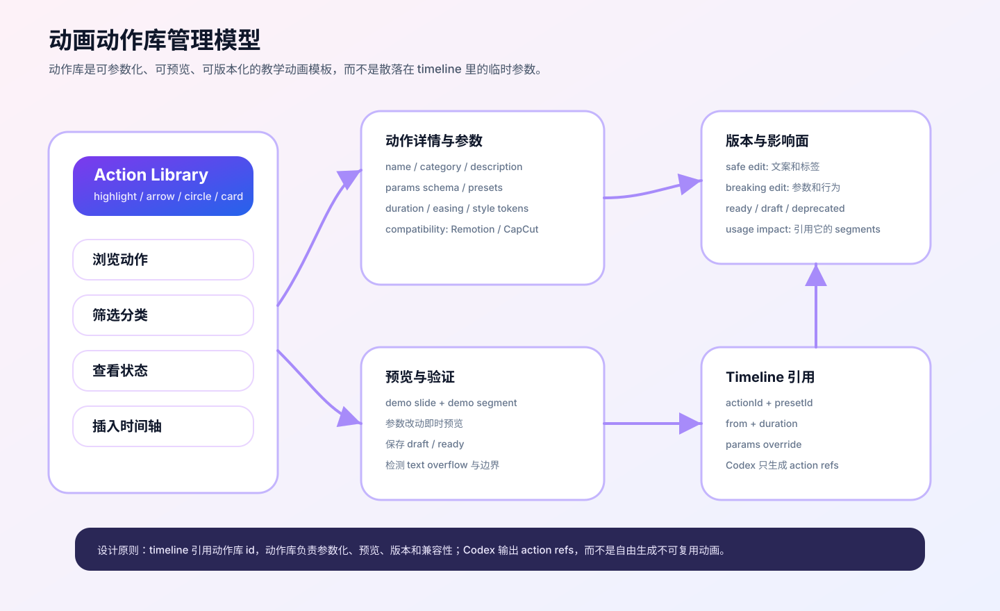

# Remotion 课程动画动作库管理设计

## 结论

动作库应该是管理台的一等模块。它不是简单的组件清单，而是一组可参数化、可预览、可版本化、可被 timeline、Remotion/HyperFrames、剪映交付包和 Codex 引用的教学动画模板。

界面方向采用 **A 的 Studio Console 配色和工作台框架 + C 的 Library Manager 交互**：

- 左侧保留 timeline 和素材上下文。
- 主制作台只保留动作库摘要和入口。
- 完整动作库拆到 `/topics/remotion-course/actions` 子页面，以表格/列表为主，支持筛选、状态、版本、使用位置。
- 右侧展示当前动作的 live preview、参数 inspector 和导出兼容性。
- Preview 展示的是每个动作/动画模块自己的效果，不只是课程整体画面。



## 动作库解决什么问题

课程视频中的动画通常不是一次性的“花活”，而是反复出现的教学表达：

- 强调某个 PPT 区域。
- 指向流程中的某个节点。
- 圈出错误点或重点数字。
- 弹出关键概念卡片。
- 切换章节标题。
- 配合人物讲解做局部 zoom。

如果这些动作不做成库，后续每个视频都会重新写一遍参数，Codex 也只能自由发挥，难以复用和稳定。

## 动作数据模型

动作不能只靠固定参数承载。第一版采用三层实现模式：

| 模式 | 用途 | 谁负责实现 |
|---|---|---|
| `parametric` | 高亮框、箭头、圈注、标题条等稳定教学动作 | 管理台表单编辑参数 |
| `llm-assisted` | 需要识别 PPT 区域、节奏、遮罩、组合动效的复杂动作 | Codex 理解意图并生成 schema/component/export plan |
| `custom-component` | 已沉淀为专用 Remotion/HyperFrames 组件的动作 | 项目组件 + 动作库引用 |

Codex 不是主存储。它负责理解意图、生成实现草稿和补齐组件契约；结果仍然必须回写动作库文件。

```ts
export type AnimationAction = {
  id: string
  name: string
  category:
    | 'highlight'
    | 'arrow'
    | 'circle'
    | 'text-card'
    | 'lower-third'
    | 'zoom'
    | 'progress'
    | 'step-reveal'
    | 'cursor'
    | 'code'
    | 'comparison'
    | 'spotlight'
    | 'transition'
  description: string
  defaultDurationFrames: number
  paramsSchema: ActionParamSchema[]
  presets: ActionPreset[]
  preview: {
    thumbnail?: string
    demoSegment: TimelineSegment
  }
  compatibility: {
    remotion: boolean
    capcutHandoff: 'native' | 'overlay' | 'manual'
  }
  version: string
  status: 'draft' | 'ready' | 'deprecated'
  implementation: {
    mode: 'parametric' | 'llm-assisted' | 'custom-component'
    intent: string
    componentContract: string
    outputFiles: string[]
    acceptance: string[]
  }
}
```

Timeline 不直接写散乱动画参数，而是引用动作。动作本身保存为项目工程文件，timeline 只保存引用和局部覆盖：

```ts
export type AnimationActionRef = {
  actionId: string
  presetId?: string
  from: number
  duration: number
  params: Record<string, unknown>
}
```

## 第一批动作类型

| 动作 | 用途 | 核心参数 | 剪映交付 |
|---|---|---|---|
| Highlight Box | 高亮 PPT 局部区域 | `x`、`y`、`w`、`h`、`color`、`label` | overlay 或 PNG |
| Arrow Callout | 指向关键区域 | `from`、`to`、`label`、`style` | overlay |
| Circle Mark | 圈注重点或错误 | `x`、`y`、`r`、`color` | overlay 或 PNG |
| Text Card | 弹出概念解释 | `text`、`position`、`tone` | overlay 或剪映文字重建 |
| Lower Third | 章节/讲师/概念标题 | `title`、`subtitle`、`position` | overlay 或剪映文字重建 |
| Slide Zoom | 局部放大和平移 | `x`、`y`、`scale` | Remotion native |
| Course Progress | 长教程学习进度 | `progress`、`position`、`chapter` | overlay |
| Step Reveal | 流程或清单逐项出现 | `step`、`totalSteps`、`layout` | overlay 或组件渲染 |
| Cursor Click | 软件教程点击提示 | `x`、`y`、`ripple`、`label` | overlay |
| Code Line Highlight | 编程课程代码行强调 | `line`、`range`、`color` | overlay 或 Remotion native |
| Before/After Wipe | 修改前后对比 | `direction`、`split`、`labels` | overlay 或 clean-ppt render |
| Spotlight Mask | 遮罩聚光讲解 | `x`、`y`、`w`、`h`、`feather` | overlay |
| Chapter Transition | 章节之间的克制转场 | `title`、`subtitle`、`effect` | overlay 或 master render |

公网部署时，这批动作是静态 mock 数据，用来让 Cloudflare 站点能直接展示管理端形态。
本地使用时，同一批动作会成为 Codex handoff、Remotion/HyperFrames 渲染和剪映交付包的源数据。

## 管理台交互设计

### 0. 动作库子页面

主制作台中的动作库是摘要面板，负责快速选择和插入动作。完整动作库放到：

```text
/topics/remotion-course/actions
```

子页面职责：

- 浏览所有 action asset。
- 查看每个动作的实现模式：`parametric` / `llm-assisted` / `custom-component`。
- 查看复杂动画的自然语言意图、组件契约、输出文件计划和验收标准。
- 后续承载动作创建 wizard、版本管理、usage impact 和 Codex 生成入口。

### 1. 动作库面板：资产管理交互

动作库不再只是卡片流，而是资产管理器。推荐结构：

```text
Action Library
  分类筛选 / 状态筛选 / 搜索
  动作列表或表格
  当前动作 preview
  当前动作 params inspector
  使用记录和导出兼容性
```

分类包含：

- 全部
- 高亮
- 指向
- 圈注
- 文字卡
- 标题条
- 镜头
- 字幕强调

每个动作行展示：

- 动作名。
- 适用场景和标签。
- 默认时长。
- Remotion 支持状态。
- 剪映/CapCut 交付方式。
- 被哪些 timeline segment 使用。
- 版本号。
- 状态：draft / ready / deprecated。

### 2. 动作详情面板

点击动作后进入详情：

- 基本信息：名称、描述、分类、版本、状态。
- 参数表单：位置、尺寸、颜色、文字、动效节奏。
- preset 列表：例如 `blue-focus`、`warning-red`、`concept-card`。
- 预览区：渲染当前动作模块自己的效果。比如 highlight-box 只看高亮框和标签，arrow-callout 只看箭头路径和指向关系，lower-third 只看标题条入场区域。
- 使用记录：哪些 timeline segment 引用了这个 action。

### 3. 新增动作

新增动作应该走一个轻量 wizard：

1. 选择动作类型。
2. 填名称和用途。
3. 定义参数 schema。
4. 配默认 preset。
5. 选择 preview demo segment。
6. 运行预览验证。
7. 保存为 draft 或 ready。

### 4. 修改动作

修改动作要区分两类：

- **安全修改**：描述、标签、默认文案、thumbnail，可以直接保存。
- **行为修改**：参数名、默认动画、渲染逻辑，需要升级 version，并提示影响哪些 timeline。

如果动作已被 timeline 引用，默认不覆盖旧版本，而是产生新版本：

```text
highlight-box@1.0.0
highlight-box@1.1.0
```

旧项目继续引用旧版本，新项目默认使用 ready 的新版本。

### 5. 插入到 timeline

在时间轴面板中，用户可以：

1. 选中 segment。
2. 点击“添加动作”。
3. 从动作库选择 action。
4. 选择 preset。
5. 在预览区拖动或输入参数。
6. 保存为 `AnimationActionRef`。

## Codex 如何使用动作库

Codex 不应该生成任意动画代码，也不应该成为动作库的主存储。它应该优先读取项目内动作库，选择 action id，或对某个 action 生成结构化修改补丁。

对于 `llm-assisted` 动作，Codex 的输入不是单纯参数，而是：

- 动作意图。
- 当前 slide / caption / script 上下文。
- 期望节奏和视觉约束。
- 组件契约。
- 需要输出的文件列表。
- 验收标准。

输入：

- 当前 slide 的视觉区域。
- 字幕句子和关键词。
- 用户指定重点。
- 可用动作库清单。

输出：

```json
{
  "segmentId": "seg-003",
  "actions": [
    {
      "actionId": "highlight-box",
      "presetId": "blue-focus",
      "from": 12,
      "duration": 90,
      "params": {
        "x": 120,
        "y": 180,
        "w": 500,
        "h": 120,
        "label": "关键定义"
      }
    }
  ]
}
```

这样 Codex 的产物可验证、可预览、可复用，也更容易在剪映/CapCut 中交付。

## 动作库与导出包的关系

每个动作需要声明导出策略：

| 策略 | 说明 | 适用动作 |
|---|---|---|
| `remotion-native` | 直接由 Remotion/HyperFrames 渲染进主视频 | zoom、caption emphasis |
| `overlay-alpha` | 输出透明通道 overlay，剪映作为叠加轨导入 | highlight、arrow、circle |
| `image-sequence` | 输出 PNG 序列，兼容多数剪辑软件 | 复杂标注、手绘线 |
| `manual-rebuild` | 输出参数和手册，让剪映人工重建 | text-card、lower-third |

动作库管理台需要让用户看见这些信息，避免后期才发现某个动作不适合剪映二次编辑。

## 第一阶段管理台中怎么落地

Phase 1 不需要完整动作编辑器，但需要留下真实入口：

- `CourseAnimationLibraryPanel`：动作库分类、表格/列表和使用状态。
- `CourseActionEditor`：动作详情、参数和兼容性编辑。
- `CoursePreviewStage`：当前动作模块 preview。
- `CourseExportPanel`：工程包、渲染包、剪映/CapCut 包和 Codex handoff 的生成入口。
- `animationLibraryModel.ts`：动作模型和 demo actions。
- `demoAnimationLibrary`：至少 5 个动作。
- Timeline segment 中引用 `actions`，而不是散落的 `highlight` 字段。
- Preview stage 能渲染至少 `highlight-box`、`arrow-callout`、`lower-third` 三类动作。

第二阶段再补：

- 动作参数编辑表单。
- preset 保存。
- action version 管理。
- usage impact 提示。
