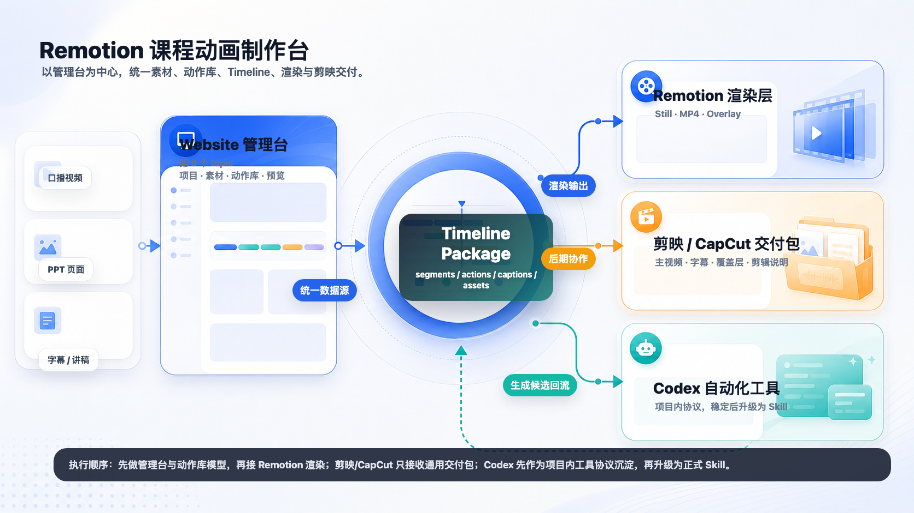

# Remotion 课程动画制作台全局计划

## 结论

这个 topic 的目标不是交付一个单独视频，而是在 `ai-website` 中建立一套可复用的课程口播动画生产系统。系统应以项目内结构化工程文件为源头，管理台负责编辑和 review，Remotion/HyperFrames/FFmpeg 负责自动渲染，剪映/CapCut 交付包负责二次后期，Codex handoff 负责辅助生成、修改和打包。

## 全局架构



四层职责：

1. **Website 管理台**：课程项目、素材、时间轴、动作库、帧预览、导出入口。
2. **项目工程文件层**：保存 `project.json`、`assets.json`、`timeline.json`、`actions/*.json` 和 `exports/manifest.json`，作为所有工具的共同源数据。
3. **自动渲染层**：Remotion/HyperFrames 消费同一份工程文件，输出 still、preview mp4、final mp4、透明 overlay；FFmpeg 负责 mux、转码、压缩和剪映友好素材。
4. **剪映/CapCut 交付层**：输出通用分层素材包，供本地剪辑软件二次包装。
5. **Codex 自动化层**：读取工程文件和素材，生成 timeline 草稿、动作建议、修改请求和交付包脚本。

## 为什么先做管理台

管理台是系统的“可视化控制面”。如果先做 Remotion composition，后续所有素材检查、动作选择、字幕时序、剪映交付和 Codex 自动化都会缺少共同数据源。

第一原则：**动画交互描述先沉淀为项目工程文件，Codex handoff 不是主存储。**

Codex handoff 的职责是辅助：

- 根据 review 意见修改某个 action 或 timeline ref。
- 根据讲稿/字幕生成候选 timeline 和动作建议。
- 根据当前工程文件打包 Remotion/剪映/CapCut 输出。
- 把人工微调后的结果转成下一轮 few-shot 示例。

项目工程文件才是稳定资产，后续 Remotion 渲染、剪映协作和 Codex skill 都只消费这份结构化数据。

先做管理台能先稳定这些核心对象：

- `CourseProject`：课程项目和全局配置。
- `AssetRegistry`：口播视频、PPT 图片、字幕、讲稿、封面和导出文件。
- `TimelineSegment`：每一段课程画面的帧范围、PPT 页、人物布局、字幕、镜头和动作。
- `AnimationAction`：可复用的教学动画模板。
- `ExportPackage`：Remotion 输出和剪映/CapCut 交付包。

## 工程文件与输出包

建议第一版在项目内沉淀为：

```text
course-project/
  project.json
  assets.json
  timeline.json
  actions/
    highlight-box.json
    arrow-callout.json
    lower-third.json
    slide-zoom.json
  exports/
    manifest.json
```

自动渲染输出：

```text
exports/render/
  preview.mp4
  final.mp4
  overlay-alpha.webm
  captions.srt
  stills/
  thumbnails/
```

剪映/CapCut 协作包：

```text
exports/capcut-handoff/
  master-preview.mp4
  clean-ppt-video.mp4
  speaker-pip.mp4
  overlays/
    001-highlight-alpha.webm
    002-arrow-alpha.webm
  captions.srt
  captions.txt
  timeline.csv
  edit-guide.md
  manifest.json
```

## 阶段计划

| 阶段 | 交付 | 目标 | 验收 |
|---|---|---|---|
| Phase 1 | Website 管理台 | 在第 9 个 topic 中管理课程项目、素材、timeline、动作和预览 | `/topics/remotion-course` 是真实管理界面 |
| Phase 2 | 动作库管理 | A 风格 Studio Console + C 交互：浏览、预览、参数化、版本、插入动作 | 动作能被 timeline 引用并能保存为工程文件 |
| Phase 3 | 工程包导出 | 生成 `project.json`、`assets.json`、`timeline.json`、`actions/*.json` 和 `manifest.json` | 管理台可展示和复制导出清单 |
| Phase 4 | Remotion/HyperFrames/FFmpeg 渲染 | 用同一份工程文件渲染 still、preview mp4、final mp4、overlay | 本地命令能产出预览视频或 still |
| Phase 5 | 剪映/CapCut 交付 | 输出 master、clean video、speaker、overlays、SRT/TXT、timeline.csv、剪辑手册 | 本地剪辑软件能按手册导入 |
| Phase 6 | Codex 自动化工具 | 根据素材和讲稿生成 timeline 与动作建议，或打包输出 | `tools/course-video-timeline/` 可校验 demo input/output |
| Phase 7 | 正式 skill | 把稳定工具升级为 Codex skill | `SKILL.md` 和使用手册齐全 |

## 项目目录计划

```text
src/features/remotion-course-workbench/
  RemotionCourseWorkbench.tsx
  courseWorkbenchData.ts
  courseTimelineModel.ts
  animationLibraryModel.ts
  CourseProjectPanel.tsx
  CourseAssetPanel.tsx
  CourseTimelinePanel.tsx
  CourseAnimationLibraryPanel.tsx
  CoursePreviewStage.tsx
  CourseExportPanel.tsx

course-project/
  project.json
  assets.json
  timeline.json
  actions/
  exports/

videos/talking-ppt-course/
  assets/
  src/
  package.json
  remotion.config.ts

tools/course-video-timeline/
  README.md
  schema/
  prompts/
  examples/
  scripts/

docs/
  remotion-course-global-plan.md
  remotion-course-workflow-design.md
  remotion-course-animation-library-management.md
  remotion-course-capcut-handoff.md
  remotion-course-codex-tool-plan.md
```

## 当前最小执行顺序

1. 新增第 9 个 topic：`remotion-course`。
2. 做管理台 shell：项目、素材、timeline、动作库、预览、导出。
3. 用 TypeScript demo 数据跑通管理台状态。
4. 定义动作库数据模型和几个代表动作。
5. 增加工程包和剪映/CapCut 交付包预览。
6. 补齐使用手册，再接 Remotion/HyperFrames/FFmpeg。
