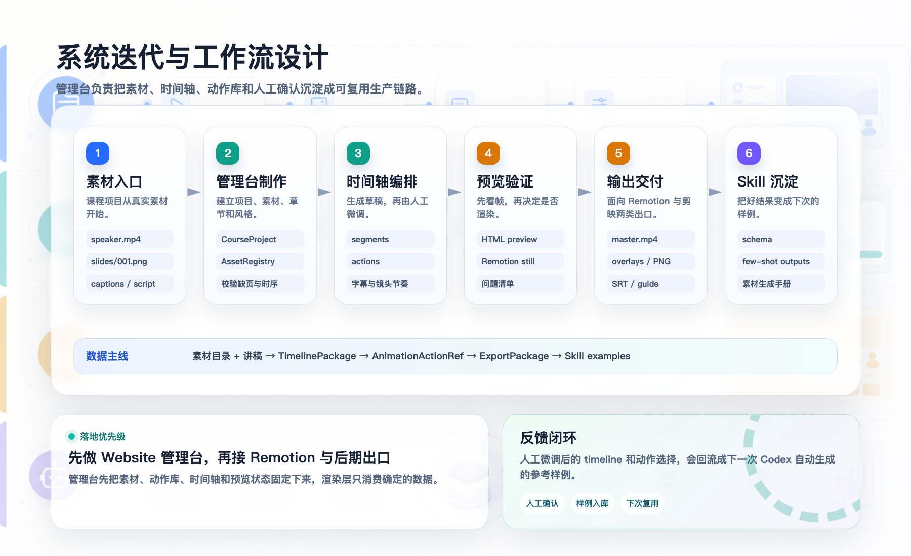
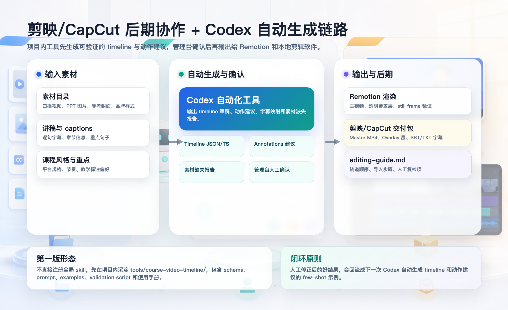

# Remotion 课程动画制作台工作流设计

## 工作流总览



这套系统不是单向生成视频，而是一个“结构化工程文件 + 人工确认 + 自动沉淀”的迭代闭环：

1. 导入素材。
2. 管理台校验素材。
3. 生成或编辑 timeline 草稿。
4. 人工微调动作、字幕、镜头和节奏。
5. 用帧预览和 Remotion still 验证。
6. 先保存项目工程文件。
7. 输出 Remotion/HyperFrames/FFmpeg 视频或剪映/CapCut 交付包。
8. 把本次人工修正沉淀为下一次 Codex 生成的参考样例。

## 管理台内工作流

| 步骤 | 操作 | 产物 |
|---|---|---|
| 创建课程项目 | 填课程名、风格、尺寸、fps、目标平台 | `CourseProject` |
| 导入素材 | 指定 speaker、slides、captions、script | `AssetRegistry` |
| 校验素材 | 检查 slide 连号、字幕时序、缺失文件 | `AssetIssue[]` |
| 生成 timeline 草稿 | 根据字幕句子或章节创建段落 | `TimelineSegment[]` |
| 插入动作 | 从动作库选择高亮、箭头、圈注、标题条等 | `AnimationActionRef[]` |
| 帧预览 | 选择 frame 或 segment 查看近似画面 | `PreviewState` |
| 保存工程 | 把课程项目、素材、timeline、actions 写成结构化工程文件 | `course-project/*` |
| 导出 | 生成 Remotion/HyperFrames 输入、剪映交付包或 skill 示例 | `ExportPackage` |

## 工程文件优先

管理台的主动作不是“提交 Codex”，而是保存结构化工程文件：

```text
course-project/
  project.json
  assets.json
  timeline.json
  actions/
  exports/
```

Codex handoff 是可选辅助。它读取工程文件，产生修改建议、动作补丁或导出脚本；执行后仍然回写工程文件，由管理台重新 review。

Cloudflare 对外站点只承载静态管理端和 mock 项目数据：

- `/topics/remotion-course` 展示制作台。
- `/topics/remotion-course/actions` 展示完整动作库子页面。
- `public/_redirects` 负责把深层路由回退到 SPA 入口，保证 Cloudflare Pages 构建后可直接访问管理端。
- 公网页面不调用本地 Codex bridge，也不依赖外部 LLM agent。

本地工具场景才启用 handoff 思路：管理台生成结构化请求，由本机 Codex、脚本或后续 skill 读取并执行。

## Remotion 工作流

Remotion/HyperFrames 不负责编辑状态，只负责渲染确定性结果：

1. 读取 timeline package。
2. 根据 frame 计算 active segment。
3. 渲染 PPT、speaker、caption、action overlay。
4. 输出 still 供检查。
5. 输出 master mp4 或 overlay media。

FFmpeg 负责：

- 合并口播视频和渲染音轨。
- 生成 `preview.mp4`、`final.mp4`。
- 转出透明 overlay 或 PNG 序列。
- 压缩剪映友好的代理文件。

## 剪映/CapCut 工作流



剪映/CapCut 接收通用交付包：

```text
exports/<project-slug>/
  master-preview.mp4
  clean-ppt-video.mp4
  speaker-pip.mp4
  overlays/
    001-highlight-alpha.webm
    002-arrow-alpha.webm
  captions.srt
  captions.txt
  timeline.csv
  thumbnails/
  manifest.json
  edit-guide.md
```

原则：

- 不依赖剪映私有工程文件。
- 主视频、字幕、覆盖层和封面都用通用格式。
- 每次导出都生成 `edit-guide.md`，记录轨道顺序、替换步骤和人工微调建议。
- 同时保留 `manifest.json` 和 `timeline.csv`，方便后续本地插件或 Codex skill 二次处理。

## Codex 自动化工作流

Codex 或本地插件不直接替代管理台，也不替代工程文件存储，而是负责生成候选或执行明确请求：

1. 读取素材目录和讲稿。
2. 根据课程风格生成 timeline 草稿。
3. 根据重点句子选择动作库里的 action id。
4. 输出缺失素材报告。
5. 管理台人工确认和微调。
6. 微调结果作为下一次 few-shot 示例。

Codex handoff 的两种职责：

1. **开发/生成职责**：根据 review 意见修改 action、生成 timeline、补动画参数。
2. **交付/协作职责**：根据当前工程生成 Remotion/HyperFrames/FFmpeg 命令、剪映素材清单和 `edit-guide.md`。
