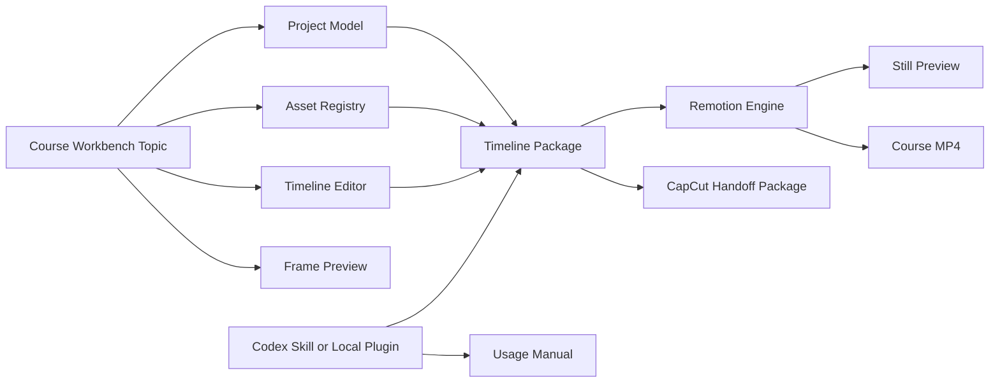
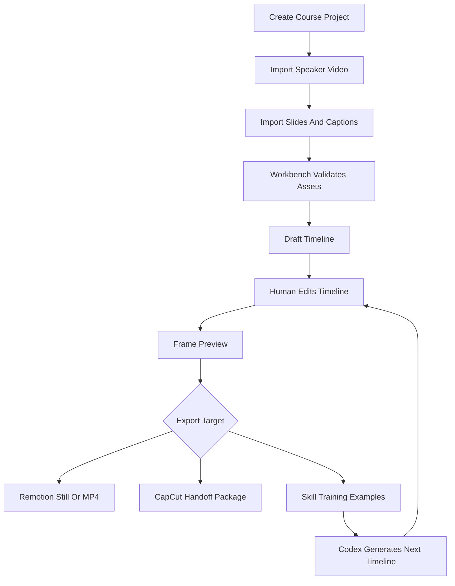

# Remotion Course Workbench Design

**Date:** 2026-07-09

## Decision

This should become the ninth topic in the `ai-website` project: a **Remotion Course Animation Workbench**, not a static demo page and not only a Remotion render folder.

The product should be designed as a four-layer system:

1. **Website workbench:** the main user-facing topic for managing course projects, assets, timeline segments, annotations, previews, and exports.
2. **Remotion render engine:** an isolated renderer under `videos/talking-ppt-course/` that turns timeline config into deterministic stills or videos.
3. **Editing handoff package:** a universal export package for CapCut/Jianying and other editing tools, avoiding fragile dependence on private project formats.
4. **Codex automation skill or local plugin:** a project-owned automation layer that turns raw assets and teaching intent into timeline config, captions, annotation suggestions, and handoff files.

The implementation order should start with the website workbench, because it defines the data model, user operations, and reusable workflow. Remotion, CapCut handoff, and Codex automation should plug into that model instead of each inventing their own shape.

## Why The Workbench Comes First

The user wants this website project to carry the knowledge-course video workflow. That means the central object is no longer “one generated video”; it is a reusable production system.

If we begin with only a Remotion composition, the user still has to hand-edit timeline config and there is no place to manage course assets, inspect missing slides, review annotation decisions, or prepare a handoff for editing software. The workbench gives the system a stable center:

- course projects and chapters;
- speaker video, slide sequence, captions, and source script status;
- timeline segments with slide, caption, speaker layout, zoom, and annotations;
- previewable frame state;
- export targets for Remotion and CapCut;
- later automation entry points for Codex.

## Product Architecture



## Workflow Architecture



## Website Topic Scope

The new topic should be named `remotion-course` and render a real management surface at `/topics/remotion-course`.

The first version is not a marketing landing page. It is a compact operational UI with four panels:

1. **Project panel:** project name, course style, total duration, slide count, caption count, annotation count, export readiness.
2. **Asset panel:** speaker video path, slide sequence completeness, captions file status, script status, and missing-file warnings.
3. **Timeline panel:** segments with `from`, `duration`, `slide`, `speaker.layout`, `caption`, `zoom`, and annotations.
4. **Preview panel:** a frame-accurate HTML approximation of the current timeline segment, including slide, speaker box, caption, lower third, progress, and at least one annotation.

The first management console can use static demo data in TypeScript. Real uploading, file watching, and persistent editing can wait until the model feels right.

## Remotion Engine Scope

The Remotion engine still belongs under `videos/talking-ppt-course/`.

It should be downstream of the workbench data model:

- consumes the same `timeline` shape used by the management UI;
- renders `TalkingPptCourse`;
- provides `npm run dev`, `npm run still`, and `npm run render`;
- owns video-specific components such as `SpeakerVideo`, `SlideStage`, `CaptionLayer`, `AnnotationLayer`, `LowerThird`, and `ProgressBar`.

The engine should not become the management UI. It should stay deterministic and file-based so that both humans and Codex automation can reproduce outputs.

## CapCut/Jianying Handoff Scope

CapCut/Jianying should be treated as the post-production destination, not as the system of record.

The project should export a **handoff package** that an editor can import into CapCut/Jianying:

```text
exports/<project-slug>/
  course-master.mp4
  overlays/
    annotation-layer.mp4
    lower-thirds.mp4
    callouts/
      001.png
      002.png
  captions/
    captions.srt
    captions.txt
  thumbnails/
    cover.png
  manifest.json
  editing-guide.md
```

Design principles:

- Do not rely on reverse-engineering CapCut project files in the MVP.
- Export universal media and text assets that editing software can import.
- Use SRT/TXT for captions because CapCut official resources describe SRT import/editing and SRT/TXT subtitle export.
- For transparent overlays, prefer PNG sequences for still callouts and test HEVC with alpha or VP9/WebM only after confirming local CapCut/Jianying behavior.
- Always include `editing-guide.md` with track order, timing notes, and replacement instructions.

## Codex Skill Or Local Plugin Scope

The automation layer should live in the project as a first-class artifact, not as vague future work.

Recommended shape:

```text
tools/course-video-timeline/
  README.md
  schema/
    timeline.schema.json
    handoff-manifest.schema.json
  prompts/
    timeline-from-script.md
    annotation-suggestions.md
  examples/
    demo-input/
    demo-output/
  scripts/
    validate-timeline.mjs
    build-handoff.mjs
```

Later, this can become a Codex skill by adding a `SKILL.md`, or it can remain a local project plugin. The important part is that the project owns the protocol:

- input: speaker video path, slide directory, captions or script, course style, user emphasis;
- output: normalized captions, timeline config, annotation suggestions, missing asset report, handoff manifest;
- optional actions: run validation, render still, build CapCut handoff package.

This gives Codex a repeatable way to help: “take these assets and make me a course timeline with teaching animations” becomes a structured operation, not a one-off prompt.

## Project Placement

Recommended file placement after implementation:

```text
src/features/remotion-course-workbench/
  RemotionCourseWorkbench.tsx
  RemotionCourseWorkbench.css
  courseWorkbenchData.ts
  courseTimelineModel.ts
  CourseProjectPanel.tsx
  CourseAssetPanel.tsx
  CourseTimelinePanel.tsx
  CoursePreviewStage.tsx

videos/talking-ppt-course/
  assets/
  src/
  package.json
  remotion.config.ts

tools/course-video-timeline/
  README.md
  schema/
  prompts/
  examples/
  scripts/

docs/remotion-course-workbench-guide.md
docs/remotion-course-capcut-handoff.md
docs/remotion-course-codex-skill-plan.md
```

## Phased Delivery

### Phase 1: Website Workbench

Build `/topics/remotion-course` as a management console using demo data.

Acceptance:

- home page lists the ninth topic;
- topic route opens a real management UI;
- UI shows project, asset status, timeline segments, annotations, and preview;
- demo data is typed and reusable by later Remotion work.

### Phase 2: Remotion Rendering

Add `videos/talking-ppt-course/` and make it consume the same timeline model.

Acceptance:

- Remotion Studio starts;
- `TalkingPptCourse` composition renders slide, speaker, caption, lower third, and annotation;
- still frame verification succeeds;
- short MP4 render works if assets are present.

### Phase 3: CapCut/Jianying Handoff

Add export conventions and documentation for editing software.

Acceptance:

- `manifest.json` describes all generated media;
- `captions.srt` and `captions.txt` are generated or documented;
- overlay exports are separated from master video where useful;
- `editing-guide.md` explains track order and CapCut/Jianying import workflow.

### Phase 4: Codex Automation Skill Or Local Plugin

Add project-owned automation protocol under `tools/course-video-timeline/`.

Acceptance:

- timeline schema and handoff manifest schema exist;
- demo input produces demo output;
- validation script catches missing slides, invalid frame ranges, and unknown annotation types;
- README explains how Codex should use the tool manually before it becomes a formal skill.

## Near-Term Implementation Recommendation

The next coding step should be **Phase 1 only**. Build the management console first and keep the Remotion and skill work represented as visible workflow outputs, docs, and placeholders. Once the workbench data model feels right, Phase 2 can wire Remotion to the same model without rewriting the interface.

