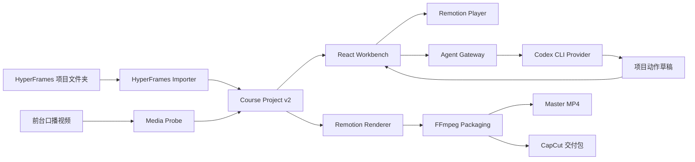

# 课程口播动画制作台生产版设计

> 日期：2026-07-10  
> 状态：待用户 Review  
> 目标：把现有交互原型升级为可真实导入、编辑、保存、预览和导出的本地课程视频生产工具，同时保留 Cloudflare 公网 Mock 展示能力。

## 1. 结论

采用 **React Web 管理台 + Node Workbench Service + Remotion 统一渲染内核 + Codex CLI Agent Gateway**。

本轮先使用真实的 `codex-keyframes-tutorial` HyperFrames 项目纵向打通完整链路，再将相同能力泛化到其他合规 HyperFrames 项目。编辑预览与最终导出必须使用同一个 Remotion Composition，动作位置、圆角、透明度和时间行为不得在导出阶段重新解释。

本轮不需要额外 API Key。智能动作生成和修改通过用户当前已登录的 Codex CLI 非交互入口完成。服务层保留 Provider 接口，后续可接入 OpenAI Responses API 或远程渲染服务。

## 2. 本轮验收范围

本轮完成以下真实闭环：

1. 导入真实 HyperFrames 项目文件夹。
2. 校验并补全 HyperFrames 元素和动画元数据。
3. 识别 scene、可编辑元素和已烘焙动画。
4. 上传独立前台口播视频，并将其音频作为最终主音轨。
5. 在统一播放器中选择元素、绑定动作、调整时间和参数。
6. 为 16:9、4:3、9:16 保存独立布局变体。
7. 保存项目，关闭后可重新打开继续编辑。
8. 使用同一个 Remotion Composition 预览与渲染。
9. 导出 `master.mp4` 和剪映/CapCut 分层交付包。
10. 通过真实浏览器、真实媒体和真实渲染产物完成验收。

### 2.1 非目标

- 不实现完整通用非线性剪辑器。
- 不直接生成剪映私有草稿工程格式；本轮输出稳定的媒体分层交付包、字幕、时间表和使用说明。
- 不在 Cloudflare 公网页面读取本地文件、执行 Codex 或渲染视频。
- 不在本轮接入 OpenAI API、云存储或云渲染，但必须保留 Provider 扩展边界。
- 不保证首次静态分析任意旧 HTML/JavaScript 项目时零人工确认。

## 3. 方案对比

### 方案 A：继续补现有前端原型

保留双 `<video>`、Reducer 状态和手工 FFmpeg 导出，继续增加导入按钮与更多动作参数。

优点是改动最少；缺点是预览与导出仍是两套坐标和动画实现，动作模板与实例继续耦合，无法根治导出错位、播放同步和项目持久化问题。

**不采用。**

### 方案 B：Web 管理台 + Node Service + Remotion 统一内核

保留现有网站入口和大部分视觉资产，增加本地服务、版本化项目模型、HyperFrames 导入器、Remotion Player/Renderer 和 Agent Gateway。

优点是复用现有产品设计最多，同时能建立可靠的媒体生产内核；后续可通过 Provider 扩展为可移植版本。

**本轮采用。**

### 方案 C：直接改造成 Electron/Tauri 桌面应用

文件系统和本地进程能力最完整，但会引入桌面打包、升级、签名和跨平台维护成本，也会明显增加现有网站的复工量。

**作为未来分发形态保留，不在本轮实施。**

## 4. 系统架构



### 4.1 前端职责

- 项目创建、导入状态和错误展示。
- Review 画布、元素选择、动作绑定和布局调整。
- 帧级播放控制和时间轴编辑。
- 动作草稿 Review、Diff、测试结果和发布操作。
- 渲染任务状态、产物预览和交付包说明。

前端不直接访问任意本地路径，不拼接 shell 命令，也不独立实现导出动画。

### 4.2 Node Workbench Service 职责

- 只监听 `127.0.0.1`。
- 管理允许访问的项目根目录。
- 读取、校验、备份和补全 HyperFrames 项目元数据。
- 探测视频尺寸、帧率、时长、音轨和可解码性。
- 保存版本化 Course Project。
- 调用 Remotion Renderer 和 FFmpeg。
- 提供 Agent Gateway 任务队列。
- 输出结构化错误，不向前端暴露任意命令执行能力。

### 4.3 公网模式

Cloudflare 构建使用 `MockWorkbenchProvider`。页面展示固定项目、动画库和渲染任务示例，但禁用本地目录选择、真实 Codex 任务和真实导出。

## 5. 项目数据模型

### 5.1 动作模板与动作实例分离

`ActionTemplate` 是共享动作库资产，不保存某条视频中的具体位置。

`ActionInstance` 是时间轴中的一次使用，保存：

- `templateId` 与模板版本。
- `targetElementId`，或者自由画布锚点。
- `fromFrame`、`durationFrames`、淡入淡出。
- 当前项目参数覆盖。
- 每种画布比例的布局覆盖。
- `exportRole`。

拖拽和尺寸修改只能更新 `ActionInstance`，不得修改共享模板。模板修改必须通过动作库编辑和版本发布流程完成。

### 5.2 动画导出角色

- `baked-internal`：HyperFrames 已烘焙在后台视频中的动画，只展示元数据，不重复导出。
- `platform-overlay`：制作台新增的标注，进入预览和最终渲染。
- `editor-only`：元素选择框、拖拽手柄、辅助线等，只存在于编辑器外壳。
- `background-only`：仅影响后台 HyperFrames 重渲染，不形成独立覆盖层。

### 5.3 主要持久化文件

```text
course-project/
  project.json
  sources/
    source-manifest.json
    media-manifest.json
  hyperframes/
    scene-map.json
    element-map.json
    baked-animation-map.json
    migration-report.json
  actions/
    instances.json
    drafts/
  layouts/
    16x9.json
    4x3.json
    9x16.json
  timeline/
    timeline.json
  renders/
  handoff/
```

文件格式使用版本号和迁移器，禁止把页面 Reducer 状态直接当作长期文件格式。

## 6. HyperFrames 上游契约

### 6.1 新项目生成规范

项目内新增 HyperFrames 课程源生成工具，至少包含：

- `SKILL.md`：指导 Codex/HyperFrames 生成可被制作台识别的项目。
- 元数据 Schema。
- 提示模板与示例项目。
- `validate` 命令。
- `migrate` 命令。

可编辑内容应声明稳定属性：

```html
<section data-hf-scene-id="scene-intro">
  <h1
    data-hf-element-id="intro-title"
    data-hf-role="title"
    data-hf-editable="true"
  >...</h1>
</section>
```

HTML `data-*` 属性负责声明 scene、元素稳定 ID、角色和可编辑性。项目动画 manifest 是内置动画时间与语义的唯一权威来源，必须声明稳定动画 ID、目标元素、起止时间、动画类型和导出角色。Importer 会校验 manifest 的目标是否能在 HTML 中找到，禁止 HTML 与 manifest 各自维护一套时间数据。

### 6.2 旧项目迁移

导入旧项目时执行：

1. 扫描 `hyperframes.json`、HTML、GSAP timeline、素材和渲染结果。
2. 将结果分为“已识别”“待补全”“无法稳定判断”。
3. 在界面展示迁移报告。
4. 用户点击一次“补全项目元数据”。
5. 创建备份或变更清单后写回稳定属性和 manifest。
6. 重新校验，成功后进入编辑台。

对于没有稳定 selector、运行时条件分支或任意 JavaScript 动画，首次导入允许人工确认。确认并写回标准元数据后，该项目必须达到完整可识别状态。

## 7. 元素识别与动画识别

### 7.1 元素识别

Importer 在 HyperFrames 页面真实运行时采集元素，而不是只靠静态正则：

- scene ID、element ID、role 和 selector。
- 元素在源画布中的像素矩形。
- 生效帧区间和可见性。
- 文本摘要、层级和缩略图。
- 各比例布局下的测量结果。

### 7.2 动画识别

新规范项目以动画 manifest 为权威来源，并在运行时校验实际目标是否存在。

旧项目分析 GSAP timeline 和声明式动画属性，不能稳定识别的项目进入待确认列表。识别到的 HyperFrames 动画默认标记为 `baked-internal`，不会自动创建平台覆盖动画。

### 7.3 变更检测

保存源文件指纹。再次导入时只重新分析变更过的 HTML、配置和素材，并报告失效的元素绑定，禁止静默把动作绑定到相似但错误的元素。

## 8. 坐标和多比例布局

### 8.1 坐标原则

- 元素矩形以 HyperFrames 源画布像素坐标存储。
- Review 画布通过明确的 viewport transform 映射源坐标。
- 绑定元素的动作优先存储相对目标元素的 inset、offset 和扩边。
- 自由标注相对于输出安全区保存。
- 前台口播窗口使用输出画布坐标，不依赖后台视频裁切。

### 8.2 比例变体

16:9、4:3、9:16 分别保存布局文件。首次创建新比例时：

1. 以目标 viewport 重渲染 HyperFrames 页面。
2. 重新测量元素。
3. 自动迁移绑定动作。
4. 生成前台窗口建议位置。
5. 用户精修后独立保存。

修改一个比例不得污染其他比例。无法自动重排的旧项目使用 `contain` 作为安全默认，并明确显示留边；不得通过隐式 `cover` 裁切假装适配成功。

## 9. 统一播放与渲染

### 9.1 单一时间源

Remotion frame 是唯一权威时间源。后台视频、前台视频、字幕和覆盖动画都由当前 frame 计算状态，不再让两个 HTML Video 自由播放后相互追赶。

媒体规则：

- 后台 HyperFrames 视频默认静音。
- 前台口播视频是主音轨。
- 总时长跟随后台区。
- 前台较短时结束后隐藏。
- 前台较长时在后台结束处截断。

### 9.2 所见即所得

Review 使用 `@remotion/player` 渲染 `CourseComposition`；最终成片使用 `@remotion/renderer` 渲染同一组件和同一份项目数据。

编辑器选择框、手柄和辅助 UI 位于 Player 外部叠加层，最终渲染路径中不存在这些节点。

## 10. 动作库与 Codex 工作流

### 10.1 三层动作体系

1. 系统动作库：稳定、版本化、可复用。
2. 项目草稿动作：Codex 生成或修改，尚未发布。
3. 项目动作实例：某条时间轴中的实际使用。

HyperFrames 内置动画不属于这三层，它是后台源的只读动画元数据。

### 10.2 动作发布

复杂动作必须包含：

- React/Remotion 组件。
- 参数 Schema 和默认值。
- 预览 fixture。
- 透明背景支持声明。
- 单元测试、关键帧测试和导出测试。
- 版本与兼容性信息。

Codex 生成后写入项目草稿目录。用户 Review 通过后点击“发布到共享动作库”，系统执行校验并生成新版本。

## 11. Agent Gateway

### 11.1 当前实现

Node Service 内提供 `AgentGateway`，当前 Provider 为 `CodexCliProvider`，通过已登录的：

```bash
codex exec --json --output-schema <schema>
```

执行结构化任务。

不依赖实验性的 Codex `app-server` 作为核心协议。

### 11.2 权限边界

- 参数调整只生成 patch，用户预览后确认应用。
- 新增复杂动作可写入当前项目的动作草稿目录。
- Agent 不能从制作台自动修改核心编辑器代码。
- 前端只能提交允许的任务类型，不能提交任意命令。
- 任务记录输入摘要、允许写入范围、输出、测试结果和失败原因。

### 11.3 Provider 扩展

统一接口至少支持：

- `CodexCliProvider`
- `MockAgentProvider`
- 预留 `OpenAIResponsesProvider`

环境变量只负责选择 Provider 和注入配置，业务模块不得读取具体模型或密钥。

## 12. 编辑器交互

### 12.1 主工作区

- 左侧：紧凑素材入口、scene/章节导航。
- 中间：Remotion Review Player、播放控制和多轨时间轴。
- 右侧：当前元素、当前动作实例和前台窗口属性。

动作库完整管理保留独立子页面；主工作区只提供搜索、选择、绑定和“打开动作库”。导出清单不再以大段 JSON 常驻页面，改为任务面板和产物列表。

### 12.2 元素与动作绑定

1. 用户在画布选择已识别元素。
2. 右侧显示该元素已有动作实例和 HyperFrames 内置动画。
3. 内置动画使用只读样式标记“已烘焙”。
4. 用户选择动作模板后创建新的平台动作实例。
5. 时间轴立即出现对应片段。
6. 画布拖拽修改当前实例，不修改模板。

### 12.3 时间轴

至少包含：

- scene/章节轨。
- 后台视频轨。
- 前台口播轨和主音频状态。
- 平台覆盖动画轨。
- HyperFrames 内置动画只读提示轨。
- 播放头、缩放、拖动起止时间和当前帧数。

## 13. 导出

### 13.1 Master

`master.mp4` 包含后台视频、前台口播、平台覆盖动画和前台主音频。导出前校验全部源文件、动作组件和绑定目标。

### 13.2 剪映/CapCut 交付包

```text
handoff/capcut/
  master-preview.mp4
  background-clean.mp4
  foreground-speaker.mp4
  overlays/
  captions.srt
  timeline.csv
  manifest.json
  edit-guide.md
```

`background-clean.mp4` 保留 HyperFrames 内置动画但不包含平台新增标注。`overlays/` 只包含明确标记为 `platform-overlay` 的动作。编辑器控件永远不进入任何产物。

## 14. 错误处理

导入、Agent 和渲染使用结构化错误码：

- `SOURCE_NOT_FOUND`
- `SOURCE_CONTRACT_INVALID`
- `ELEMENT_ID_CONFLICT`
- `ANIMATION_TARGET_MISSING`
- `MEDIA_UNDECODABLE`
- `AGENT_TASK_FAILED`
- `ACTION_VALIDATION_FAILED`
- `RENDER_FAILED`
- `OUTPUT_VERIFICATION_FAILED`

错误信息必须包含发生阶段、受影响文件或元素、可执行的最小修复动作。不能只显示“失败”或把完整终端日志直接倾倒给用户。

## 15. 测试与验收

### 15.1 测试层次

1. Schema 与迁移单元测试。
2. 坐标变换和比例变体单元测试。
3. 动作模板与实例隔离测试。
4. Importer 对真实 HyperFrames fixture 的集成测试。
5. Node API 与文件写入集成测试。
6. Remotion Player 浏览器交互测试。
7. Remotion 真正渲染 still 和短视频测试。
8. FFprobe 校验尺寸、时长、帧率和音轨。
9. 关键帧像素对比，确认 Preview 与 Render 坐标一致。

### 15.2 必须通过的真实案例

使用现有 `codex-keyframes-tutorial` 项目：

- 完成旧项目元数据迁移。
- 识别全部声明 scene、元素和内置动画。
- 为标题绑定红色圆角圈注。
- 分别验证 9:16、16:9 和 4:3 布局变体。
- 使用独立前台口播素材验证主音轨、短视频隐藏和长视频截断。
- 导出完整 Master 和 CapCut 交付包。
- 对圈注出现前、强调中、消失后各取一帧比对。
- 验证选择框、移动圆点和缩放手柄不出现在成片。

### 15.3 完成定义

只有同时满足以下条件才能宣称功能完成：

- 单元、集成、浏览器和真实渲染测试通过。
- 真实视频可播放且音轨正确。
- Preview 与 Render 的目标元素和动作框位置一致。
- 动作按时间出现和消失。
- 重载项目后编辑状态不丢失。
- 公网 Mock 构建通过且不会尝试连接本地服务。

## 16. 迁移与复用原则

保留现有：

- Topic 路由和公网展示入口。
- 当前后台区/前台区产品语言。
- 动作分类、动作库子页面和大部分视觉规范。
- 已有动作数据作为迁移输入。
- HyperFrames 内置动画与平台覆盖动画的角色区分。

替换或重构：

- 页面内存作为唯一项目状态。
- 双 HTML Video 自由播放同步。
- 模板参数直接承担实例位置。
- Mock 元素坐标作为真实识别结果。
- 只生成文件名清单的伪导出。
- 前端硬编码本机绝对路径。

## 17. 实施分解

后续施工计划按以下里程碑展开：

1. 项目 Schema、迁移器和本地服务骨架。
2. HyperFrames 上游规范工具、校验器和旧项目迁移。
3. 真实导入、媒体探测和项目持久化。
4. Remotion Composition、Player 和单一时间源。
5. 动作模板/实例分离与多比例布局。
6. 编辑器交互和时间轴重构。
7. Agent Gateway 与动作草稿发布流程。
8. Master/CapCut 导出和产物校验。
9. 真实案例端到端验收与公网 Mock 回归。

每个里程碑都必须先写失败测试，再实现最小通过版本，并在真实浏览器或真实媒体层完成对应验收，不能把 jsdom 中的 Mock 媒体测试当作最终验收。
